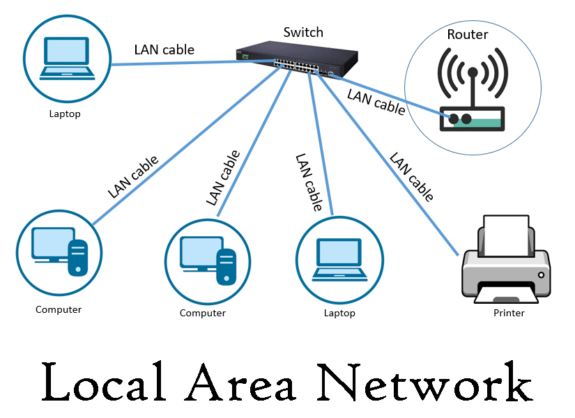

# Networking basics #0

## OSI Model
>The Open Systems Interconnection model (OSI model) is a conceptual model from the International Organization for Standardization (ISO) that "provides a common basis for the coordination of standards development for the purpose of systems interconnection

>In the OSI reference model, the communications between systems are split into seven different abstraction layers: <b>Physical</b>, <b>Data Link</b>, <b>Network</b>, <b>Transport</b>, <b>Session</b>, <b>Presentation</b>, and <b>Application</b>.

>The model partitions the flow of data in a communication system into seven abstraction layers to describe networked communication from the physical implementation of transmitting bits across a communications medium to the highest-level representation of data of a distributed application. Each intermediate layer serves a class of functionality to the layer above it and is served by the layer below it. Classes of functionality are realized in all software development through all standardized communication protocols.

## Layer architecture
<table border="1">
    <tr>
        <th colspan = 3 >Layer</th>
        <th>Protocol Data Unit (PDU)</th>
        <th>Function</th>
    </tr>
    <tr>
        <td rowspan="4">Host layers</td>
        <td>7</td>
        <td>Application</td>
        <td rowspan=3>Data</td>
        <td>High-level protocols such as for resource sharing or remote file access, e.g. HTTP.</td>
    </tr>
    <tr>
        <td>6</td>
        <td>Presentation</td>
        <td>Translation of data between a networking service and an application; including character encoding, data compression and encryption/decryption</td>
    </tr>
    <tr>
        <td>5</td>
        <td>Session</td>
        <td>Managing communication sessions, i.e., continuous exchange of information in the form of multiple back-and-forth transmissions between two nodes</td>
    </tr>
    <tr>
        <td>4</td>
        <td>Transport</td>
        <td>Segment, Datagram</td>
        <td>Reliable transmission of data segments between points on a network, including segmentation, acknowledgement and multiplexing</td>
    </tr>
    <tr>
        <td rowspan="3">Media layers</td>
        <td>3</td>
        <td>Network</td>
        <td>Packet</td>
        <td>Structuring and managing a multi-node network, including addressing, routing and traffic control</td>
    </tr>
    <tr>
        <td>2</td>
        <td>Data link</td>
        <td>Frame</td>
        <td>Transmission of data frames between two nodes connected by a physical layer</td>
    </tr>
    <tr>
        <td>1</td>
        <td>Physical</td>
        <td>Bit, Symbol</td>
        <td>Transmission and reception of raw bit streams over a physical medium</td>
    </tr>
</table>

## Types of Area Networks

* <b>LAN</b>: Local Area Network  
* <b>WAN</b>: Wide Area Network  
* <b>WLAN</b>: Wireless Local Area Network  
* <b>MAN</b>: Metropolitan Area Network  
* <b>SAN</b>: Storage Area Network, System Area Network, Server Area Network, or sometimes Small Area Network  
* <b>CAN</b>: Campus Area Network, Controller Area Network, or sometimes Cluster Area Network  
* <b>PAN</b>: Personal Area Network  

## What is a LAN
>A <b>local area network (LAN)</b> is a computer network that interconnects computers within a limited area such as a residence, school, laboratory, university campus or office building. 

## What is a WAN

>A <b>wide area network (WAN)</b>  is a telecommunications network that extends over a large geographic area. Wide area networks are often established with leased telecommunication circuits.

## What is the Internet
> The <b>Internet </b> s the global system of interconnected computer networks that uses the Internet protocol suite (TCP/IP)[b] to communicate between networks and devices. It is a network of networks that consists of private, public, academic, business, and government networks of local to global scope, linked by a broad array of electronic, wireless, and optical networking technologies. The Internet carries a vast range of information resources and services, such as the interlinked hypertext documents and applications of the World Wide Web (WWW), electronic mail, telephony, and file sharing.

## What is an IP address

>Every machine on the the Internet has a unique number assigned to it, called an IP address. Without a unique IP address on your machine, you will not be able to communicate with other devices, users, and computers on the Internet. You can look at your IP address as if it were a telephone number, each one being unique and used to identify a way to reach you and only you.

>An IP address always consists of 4 numbers separated by periods, with the numbers having a possible range of 0 through 255. An example of how an IP address appears is: 192.168.1.10

## What are the 2 types of IP address

>There are two flavors of IP Addresses that can be used on a network. The first, and the version that the Internet and most routers are currently configured for, is IPv4 or Internet Protocol version 4. This version uses 32-bit addresses, which limits the amount of addresses to 4,294,967,296 possible unique addresses. Some of these addresses, about 290 million, are also reserved for special purposes. Due to the popular growth of the Internet there has been concern that the pool of possible addresses would be exhausted in the near future. With this in mind, a new version of IP addresses was developed called IPv6, or Internet Protocol version 6, that would change the address size from 32-bit address to 128-bit addresses. This change would allow for generous IP address allocations to networks without any foreseeable problem with the amount of addresses available. In order to use IPv6 addresses, though, existing routers and hardware would need to be upgraded or configured to use this new version of IP addresses.

## What is a MAC Address ?
>A <b>Media Access Control (MAC)</b> address is a string of characters that identifies a device on a network. It’s tied to a key connection device in your computer called the network interface card, or NIC. The NIC is essentially a computer circuit card that makes it possible for your computer to connect to a network. A NIC turns data into an electrical signal that can be transmitted over the network. Every NIC has a hardware address that’s known as a MAC address. Whereas IP addresses are associated with a networking software called TCP/IP, MAC addresses are linked to the hardware of network adapters

## Public Ip and Peivate IP

>A <b>public IP</b> address is an IP address that can be accessed over the Internet. Like postal address used to deliver a postal mail to your home, a public IP address is the globally unique IP address assigned to a computing device. Your public IP address can be found at What is my IP Address page. <b>Private IP</b> address, on the other hand, is used to assign computers within your private space without letting them directly expose to the Internet. For example, if you have multiple computers within your home you may want to use private IP addresses to address each computer within your home. In this scenario, your router gets the public IP address, and each of the computers, tablets and smartphones connected to your router (via wired or wifi) gets a private IP address from your router via DHCP protocol.

## What is localhost

>In computer networking, localhost is a hostname that refers to the current computer used to access it. The name localhost is reserved for loopback purposes. It is used to access the network services that are running on the host via the loopback network interface. Using the loopback interface bypasses any local network interface hardware.

## What is a subnet

>A <b>subnetwork or subnet</b> is a logical subdivision of an IP network.[1]: 1, 16  The practice of dividing a network into two or more networks is called subnetting.

## TCP/UDP

>TCP/IP is a suite of protocols used by devices to communicate over the Internet and most local networks. It is named after two of it's original protocols the Transmission Control Protocol (TCP) and the Internet Protocol (IP). TCP provides apps a way to deliver (and receive) an ordered and error-checked stream of information packets over the network. The User Datagram Protocol (UDP) is used by apps to deliver a faster stream of information by doing away with error-checking. When configuring some network hardware or software.

## What is the main difference between TCP and UDP

>Both TCP and UDP are protocols used for sending bits of data---known as packets---over the Internet. Both protocols build on top of the IP protocol. In other words, whether you're sending a packet via TCP or UDP, that packet is sent to an IP address. These packets are treated similarly, as they're forwarded from your computer to intermediary routers and on to the destination.

####  How TCP Works

>When you request a web page in your browser, your computer sends TCP packets to the web server's address, asking it to send the web page back to you. The web server responds by sending a stream of TCP packets, which your web browser stitches together to form the web page. When you click a link, sign in, post a comment, or do anything else, your web browser sends TCP packets to the server and the server sends TCP packets back.

>TCP is all about reliability---packets sent with TCP are tracked so no data is lost or corrupted in transit. This is why file downloads don't become corrupted even if there are network hiccups. Of course, if the recipient is completely offline, your computer will give up and you'll see an error message saying it can't communicate with the remote host.

>TCP achieves this in two ways. First, it orders packets by numbering them. Second, it error-checks by having the recipient send a response back to the sender saying that it has received the message. If the sender doesn't get a correct response, it can resend the packets to ensure the recipient receives them correctly.

####  How UDP Works

>The UDP protocol works similarly to TCP, but it throws out all the error-checking stuff. All the back-and-forth communication introduce latency, slowing things down.

>When an app uses UDP, packets are just sent to the recipient. The sender doesn't wait to make sure the recipient received the packet---it just continues sending the next packets. If the recipient misses a few UDP packets here and there, they are just lost---the sender won't resend them. Losing all this overhead means the devices can communicate more quickly.

>UDP is used when speed is desirable and error correction isn't necessary. For example, UDP is frequently used for live broadcasts and online games.

>For example, let's say you're watching a live video stream, which are often broadcast using UDP instead of TCP. The server just sends a constant stream of UDP packets to computers watching. If you lose your connection for a few seconds, the video may freeze or get jumpy for a moment and then skip to the current bit of the broadcast. If you experience minor packet-loss, the video or audio may be distorted for a moment as the video continues to play without the missing data.

>This works similarly in online games. If you miss some UDP packets, player characters may appear to teleport across the map as you receive the newer UDP packets. There's no point in requesting the old packets if you missed them, as the game is continuing without you. All that matters is what's happening right now on the game server---not what happened a few seconds ago. Ditching TCP's error correction helps speed up the game connection and reduce latency.

