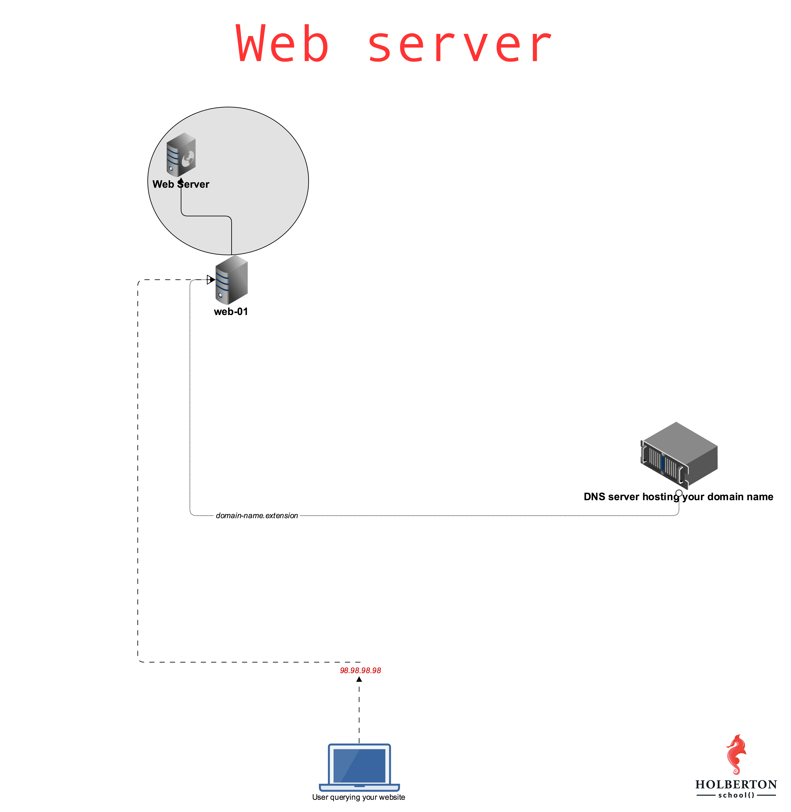

# WEB SERVER 

## What is a Child Process?

( <b>*(What is a Processe at firet)*</b> Processes are the primitive units for allocation of system resources. Each process has its own address space and (usually) one thread of control. A process executes a program; you can have multiple processes executing the same program, but each process has its own copy of the program within its own address space and executes it independently of the other copies.)

>A child process is a process created by another process, known as the parent process. The child process can start or stop independently without affecting the parent process. However, it is typically dependent on the parent process. If the parent process terminates, the child process becomes an orphan process.

>In the context of server operations, the kernel and programs like Apache may create child processes. For example, Apache spawns child processes when the number of requests exceeds the maximum allowed. When the maximum number of child process requests is reached, another child process is created.

To view all running processes along with their child processes in a "tree" format, you can use the following command:

<pre>
    <code>
       $ ps axf
    </code>
</pre>

## How the Web Works ?

>The concept of how the web works provides a simplified explanation of the process that occurs when you view a webpage in a web browser on your computer or phone.

### Clients and servers

>Computers connected to the internet are referred to as clients and servers. Here is a simplified diagram illustrating their interaction:  
 

## Clients and Servers

- Clients refer to the typical web user's internet-connected devices, such as computers or phones, and the web-accessing software available on those devices (e.g., web browsers like Firefox or Chrome).
- Servers are computers that store webpages, sites, or apps. When a client device wants to access a webpage, a copy of the webpage is downloaded from the server onto the client machine to be displayed in the user's web browser.

### The other parts of the toolbox

> The client and server we've described above don't tell the whole story. There are many other parts involved, and we'll describe them below. 
To better understand the web, let's use an analogy. Imagine the web as a road. On one end of the road is the client, which is like your house. On the other end of the road is the server, which is a shop you want to buy something from.

In addition to the client and the server, we also need to say hello to:

## Internet Connection
>Your internet connection allows you to send and receive data on the web. It's like the street between your house and the shop.

## TCP/IP
>Transmission Control Protocol and Internet Protocol are communication protocols that define how data should travel across the internet. It's like the transport mechanisms that let you place an order, go to the shop, and buy your goods.

## DNS
>Domain Name System is like an address book for websites. When you type a web address in your browser, the browser looks at the DNS to find the website's IP address before it can retrieve the website. It's like looking up the address of the shop so you can access it.

## HTTP
>Hypertext Transfer Protocol is an application protocol that defines a language for clients and servers to speak to each other. It's like the language you use to order your goods.

## Component Files
>A website is made up of many different files, which are like the different parts of the goods you buy from the shop. These files come in two main types:

- Code files: Websites are built primarily from HTML, CSS, and JavaScript, though you'll meet other technologies a bit later.
- Assets: This is a collective name for all the other stuff that makes up a website, such as images, music, video, Word documents, and PDFs.

## So what happens, exactly?
When you type a web address into your browser (for our analogy that's like walking to the shop):

1- The browser goes to the DNS server, and finds the real address of the server that the website lives on (you find the address of the shop).  

2- The browser sends an HTTP request message to the server, asking it to send a copy of the website to the client (you go to the shop and order your goods). This message, and all other data sent between the client and the server, is sent across your internet connection using TCP/IP. 

3- If the server approves the client's request, the server sends the client a "200 OK" message, which means "Of course you can look at that website! Here it is", and then starts sending the website's files to the browser as a series of small chunks called data packets (the shop gives you your goods, and you bring them back to your house). 

4- The browser assembles the small chunks into a complete web page and displays it to you (the goods arrive at your door — new shiny stuff, awesome!). 

# Nginx

>Nginx (pronounced "engine-x") is a popular open-source web server and reverse proxy server. It's renowned for its high performance, stability, and scalability, frequently used to serve web content and handle incoming HTTP requests. Originally developed to solve the C10k problem, which focused on handling a large number of concurrent connections efficiently, Nginx has grown into a versatile tool for various web-serving tasks.